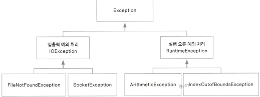

## 14. 예외 처리
### 14-1 예외 클래스

> 예외 클래스의 계층 구조
> 

### 14-2 예외 처리하기

- try-catch 문
```java
try {
	// 예외가 발생할 수 있는 코드 구현
} catch(예외 타입 e) {
	// 예외가 발생했을 때 예외를 처리할 코드
}
```

- 예외 처리 실습
```java
public static void main(String[] args) {
	int[] arr = new int[5];
	// ArrayIndexOutOfBoundsException 예외 발생
	try {
		for (int i = 0; i <= 5; i++) {
			arr[i] = i;
		}
	} catch (ArrayIndexOutOfBoundsException e) {
		System.out.println(e);
	}
	System.out.println("프로그램 종료");
}
```

```bash
# 결과
java.lang.ArrayIndexOutOfBoundsException: Index 5 out of bounds for length 5
프로그램 종료
```

- finally 실습
```java
public static void main(String[] args) {
	int[] arr = new int[5];
	// ArrayIndexOutOfBoundsException 예외 발생
	try {
		for (int i = 0; i <= 5; i++) {
			arr[i] = i;
		}
	} catch (ArrayIndexOutOfBoundsException e) {
		System.out.println(e);
	} finally {
		System.out.println("예외 여부 관계 없이 항상 실행");
	}
}
```

```bash
# 결과
java.lang.ArrayIndexOutOfBoundsException: Index 5 out of bounds for length 5
예외 여부 관계 없이 항상 실행
```

- try-with-resources문
  시스템 리소스를 close 하지 않아도 try 내부에서 열린 리소스를 자동으로 닫아줌 (python `with`랑 비슷한 듯)
```java
try(ReSrc obj = new ReSrc()) {
} catch {
}
```

### 14-3 예외 처리 미루기

- throw 사용하기
```java
// throws 를 사용하여 예외 상황 정의
public Class loadClass(String s1, String s2) throws FileNotFoundException, ClassNotFoundException {
	FileInputStream fis = new FileInputStream(s1);
	Class c = Class.forName(s2);
	return c;
} 

public static void main(String[] args) {
	day11 test = new day11();
	try {
		test.loadClass("a.txt", "java.lang.String");
	// 예외 처리
	} catch (FileNotFoundException | ClassNotFoundException e) {
		System.out.println(e);
	}
}
```

- 다중 예외 처리
  catch를 여러번 넣으면서 예외 처리를 여러번 할 수 있다.
```java
try {
} catch(FileNotFoundException e) {
} catch(ClassNotFoundException e) {
} catch(Exception e) {
}
```

### 14-4 사용자 정의 예외

- 상속을 통한 예외 상황 정의
```java
class IDFormatException extends Exception {
    public IDFormatException(String message) {
        super(message);
    }
}
```

- 실습 코드 작성
```java
private String userId;

String getUserId() {
	return userId;
}

void setUserId(String userId) throws IDFormatException {
	if (userId == null) {
		throw new IDFormatException("ID는 비울 수 없습니다.");
	} else if (userId.length() < 8 || userId.length() > 20) {
		throw new IDFormatException("아이디는 8자 이상 20자 이하여야 합니다.");
	}
	this.userId = userId;
}

public static void main(String[] args) {
	day11 day11 = new day11();
	String userid = null;
	try {
		day11.setUserId(userid);
	} catch(IDFormatException e) {
		System.out.println(e);
	}
	userid = "aaaa";
	try {
		day11.setUserId(userid);
	} catch(IDFormatException e) {
		System.out.println(e);
	}
}
```

```bash
# 결과
IDFormatException: ID는 비울 수 없습니다.
IDFormatException: 아이디는 8자 이상 20자 이하여야 합니다.
```
