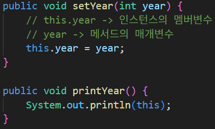
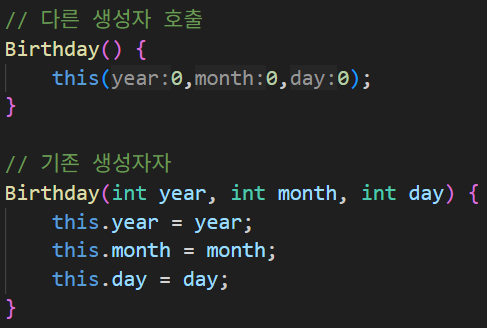
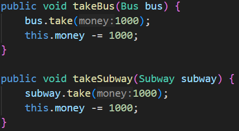
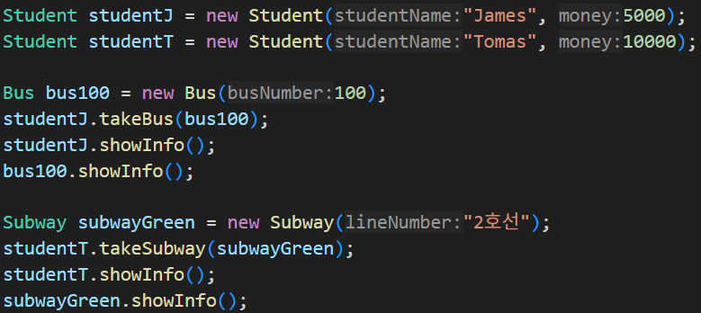
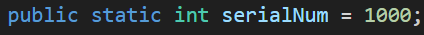
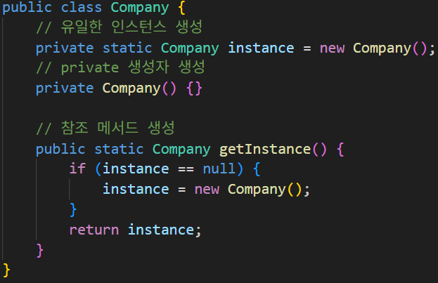

## 6. 클래스와 객체 2
### 06-1 this 예약어
- 자신의 인스턴스를 가리킴

### 06-2 객체 간 협력
Student 객체에서 Bus, Subway 객체의 사용(협력)

메인 함수 작성 예시

### 06-3 static 변수
- 여러 클래스에서 사용가능한 '전역' 변수 개념
- 프로그램 시작과 함께 메모리에 작성되기에 정적 변수라고 불린다.

### 06-4 변수 유효 범위
- 지역 변수 - 함수 내부에서 유효
- 멤버 변수 - 클래스 내부 어느 메소드에서나 유효
- static 변수 - private 변수가 아니라면 어떤 클래스에서든 유효

### 06-5 static 유효 - 싱글톤 패턴
- 하나의 인스턴스만 생성하여 사용하는 디자인 패턴

