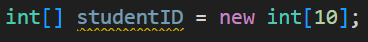
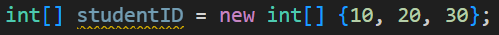
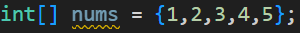
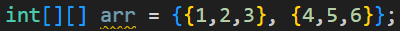
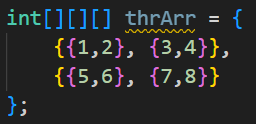
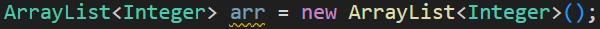
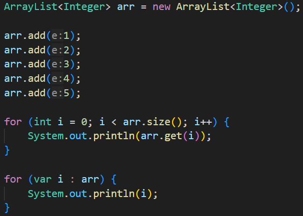

## 7. 배열과 ArrayList
### 07-1 배열이란
자료형을 나열한 것?

- 선언

- 초기화

- 사용
  인덱스는 0번부터 

### 07-2 다차원 배열

- 3차원 배열

### 07-3 ArrayList 클래스
길이 변경 및 요소 위치 변경 등 편리성을 추가함

- 메서드
	- add(e)
	- size()
	- get(int index)
	- remove(int index)
	- isEmpty()

- 선언

### 07-4 배열 응용 프로그램
