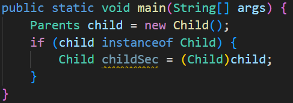

## 8. 상속과 다형성
### 08-1 상속이란?
기존 클래스가 새로운 클래스에게 멤버 변수와 메서드 등을 물려주는 것.


상속 받을 클래스에서 extends 부모 클래스 를 뒤에 붙여 사용

### 08-2 상속에서 클래스 생성과 형 변환


예제 코드.

실행 결과
```bash
부모 클래스 생성자 호출
자식 클래스 생성자 호출
```

`super()` 예약어.

자식 클래스의 생성자를 호출할 때 `super()` 예약어를 자동적으로 호출함. 해당 예약어를 사용하여 부모 클래스의 다른 생성자를 사용할 수 있음.


예제 코드.

실행 결과
```bash
num1, num2 생성자 호출
자식 클래스에서 부모 클래스의 (num1, num2) 생성자 호출
```

업캐스팅


하위 클래스(자식)를 생성해 상위 클래스(부모)로 형 변환


업캐스팅한 객체를 다시 하위 클래스(자식)로 형 변환하는 것을 다운캐스팅이라고 한다.

### 08-3 메서드 오버라이딩


부모 클래스에 메서드 추가.


자식 클래스의 오버라이딩


메인 함수 코드.

실행 결과
```bash
num1, num2 생성자 호출
num1, num2 생성자 호출
자식 클래스에서 부모 클래스의 (num1, num2) 생성자 호출
4
5
2
2
```

### 08-4 다형성
하나의 코드에 여러 자료형이 구현되어 실행되는 것.

실습 코드


실행 결과
```bash
1
1
3
4
```

### 08-5 다형성 활용하기
.

### 08-6 다운 캐스팅과 instanceof
- instanceof
  상위 클래스로 형 변환된 인스턴스의 원래 자료형을 확인하는 예약어



`if (child instanceof Child)` 를 사용하여 자료형을 검사하고 `True` 이면 다운 캐스팅