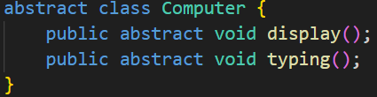
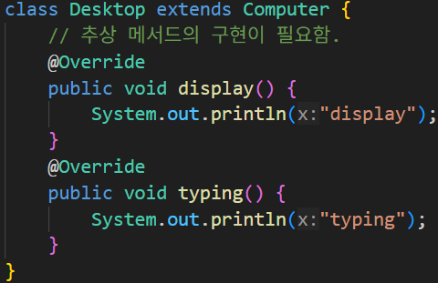
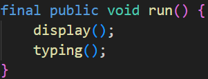
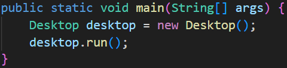
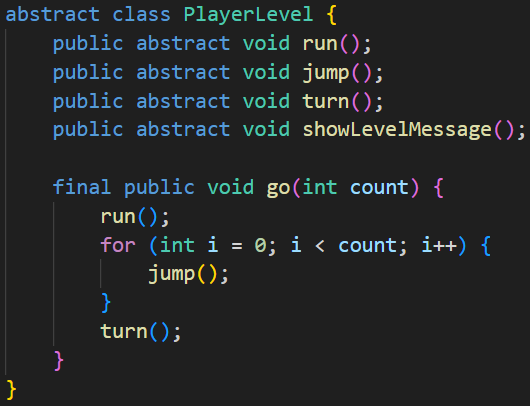
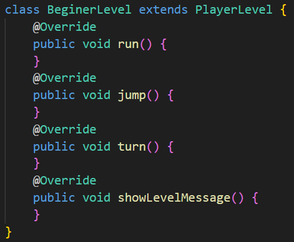
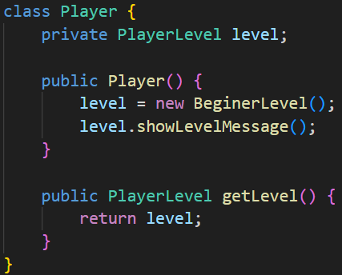

## 9. 추상 클래스
### 09-1 추상 클래스

추상 클래스의 선언과 추상 메서드의 선언

추상 클래스의 상속

### 09-2 템플릿 메서드

템플릿 메서드의 구현

템플릿 메서드의 사용

메서드의 실행 순서(로직 흐름)를 정의하는 역할로 사용

하위 클래스(상속 받은 자식 클래스) 에서 필요한 기능을 정의해서 사용 가능

### 09-3 템플릿 메서드 응용하기

추상 클래스 정의

추상 클래스 상속

다형성 클래스 정의

### 09-4 final 예약어

final은 상수를 뜻 함

final 예약어를 사용한 클래스, 메서드, 변수를 변경 불가능

여러 파일에서 공유하는 상수를 미리 정의할 때 final 클래스에 멤버 변수로 정의해 사용할 수도 있다.