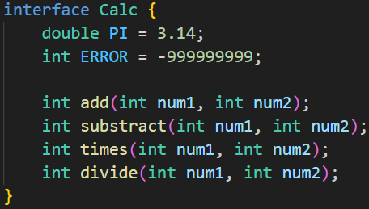
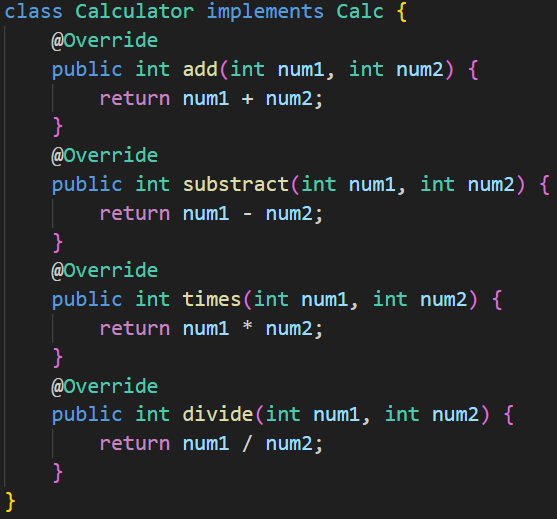
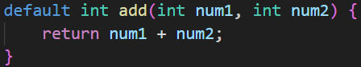
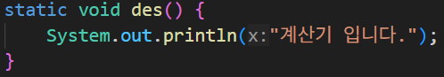
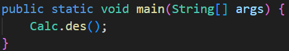
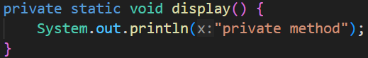
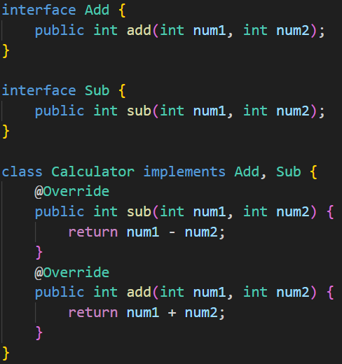

## 10. 인터페이스
### 10-1 인터페이스란?

- 클래스 혹은 프로그램이 제공하는 기능을 명시적으로 선언하는 역할
- 추상 클래스와 상수로만 이루어짐
- 구현없이 명시적으로 선언만 함

인터페이스를 클래스로 구현할 때 추상 클래스를 상속받는 것과 마찬가지로 모든 추상 메서드를 구현해야하며 `extends` 가 아닌 `implements` 를 통해 구현한다.

### 10-2 인터페이스와 다형성

### 10-3 인터페이스 요소
- 인터페이스 상수
  인터페이스에서 선언되는 변수는 모두 상수로 컴파일된다.
- 디폴트 메서드
  인터페이스에서 기능 구현 코드가 작성된 메서드, `default`
 예약어 사용, `@override` 어노테이션을 활용해 재정의 가능
  
  
- 정적 메서드
  `static` 예약어를 사용해 클래스의 생성과 무관하게 사용할 수 있음 `[interface 명].[method 명]` 으로 사용
  
  
  
  
- private 메서드
  인터페이스 구현 클래스에서 사용하거나 재정의 불가능,
  
  

### 10-4 인터페이스 활용하기

기능 별 인터페이스 구현 후 클래스에 상속

인터페이스 간의 상속은 `extends` 예약어를 사용함

실무 사용 예시, DB 연결용 인터페이스 구현